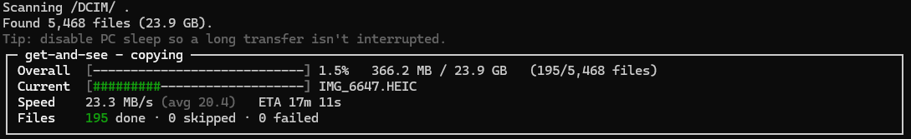

# get-and-see

Windows tool that copies an iPhone camera roll to a PC over USB, then lets you search that archive and
send media back to an iPhone or an Android phone.

The backup path uses Apple's **AFC** protocol (the same family Finder, iTunes, and iMazing use). It does
**not** use Windows MTP / Explorer, which drops connections and can leave 0-byte files on a large library.

There are two interfaces over the same archive:

- **Desktop app** (`GetAndSee.Gui`) — backup, restore, search, and library maintenance.
- **Command line** (`get-and-see.exe`) — the same backup, status, search, and reorganize operations for scripts.

The interface is in **简体中文** and **English**.

> ## Backup never writes to the iPhone.
> The AFC client only lists and reads `/DCIM/`. There is no write, delete, rename, or move path against
> the iPhone, and [`ReadOnlyContractTests`](tests/GetAndSee.SafetyTests/ReadOnlyContractTests.cs) fails
> the build if one is added.
>
> **Restore is a separate step, and it does copy files onward:**
>
> - **Restore to iPhone** fills a folder on the PC. Apple's **Apple Devices** app syncs that folder into
>   Photos. Changing the sync folder can make Apple Devices remove photos it previously synced from the
>   PC. Photos taken on the iPhone are not part of that cleanup. The app asks before you change the folder.
> - **Restore to Android** uploads the chosen files to the phone over FTP.

## Quick start

### Desktop app

```pwsh
# Plug in the iPhone, unlock it, and tap "Trust This Computer".
# Apple Devices (Microsoft Store) or iTunes must be installed. Open Apple Devices once after each reboot.
dotnet run --project src/GetAndSee.Gui -c Release
```

In **Backup to PC**, choose a destination folder and start the incremental backup. Re-run the same
destination later to copy only what is new. Stop at any time; the next run resumes.

### Command line

```pwsh
get-and-see copy --dest "D:\Photos"
```

Leave it running. Stop or unplug whenever you need to, then run the same command again to resume.
Nothing is written to or deleted from the iPhone.

> **iCloud Photos with "Optimize iPhone Storage"?** Read
> [iCloud and Optimize iPhone Storage](#icloud-and-optimize-iphone-storage) first. Some full-resolution
> originals may be in iCloud rather than on the device.

## Desktop app

Build it with the .NET 10 SDK (see [Install](#install)). The window has seven pages:

| Page | What it does |
|------|----------------|
| **Backup to PC** | Incremental copy of `/DCIM/` into a date-organized archive. Scope can be the whole roll, a capture-date range, or selected DCIM folders. Preview plans the run without copying. |
| **Restore to iPhone** | Copies a chosen slice of the archive into a sync folder (all, date range, folders, or a manual list). Then opens **Apple Devices** so you can sync that folder into Photos. Live Photo stills and their `.MOV` videos stay paired. |
| **Restore to Android** | Uploads a chosen slice to an FTP server on the phone. **Default** sends the current selection. **Historical incremental** skips files already recorded for that device. |
| **Archive status** | File counts, size, and devices seen by this archive. Last seen is the device's last backup time. |
| **Media search** | Filter by date, file name, media type, camera (a known model or a keyword), and GPS. Sort the full result by capture time, name, size, type, or camera. Table or gallery. Gallery video cells prefer the paired Live Photo still. Double-click opens the preview; videos play there. |
| **Layout reorganize** | Moves an existing archive into another folder layout on the PC. Preview first. |
| **Settings** | EXIF time sync onto Windows file times, read timeout, and whether to offer keeping the PC awake. Language is the 中文 / English switch in the header. |

Search can also add files to the iPhone or Android restore list. Right-click a result, or drag files in
from Explorer.

The desktop app and the command line share one destination folder and one `get-and-see.db`. A backup
started in either place is visible to the other.

## What you get

- **Every file** in `/DCIM/` when you back up the full roll — photos, videos, Live Photos, screenshots,
  and screen recordings — with the original EXIF left intact.
- **Organized by date**: flat `YYYY-MM/filename.ext` by default (for example `2024-08/IMG_4821.HEIC`).
  Other layouts are `year-month` (`YYYY/YYYY-MM`), `year`, and `flat`. Files with no trustworthy capture
  date go to `unsorted/`.
- **A SQLite manifest** (`get-and-see.db`) at the destination root: date, GPS, camera, size, and paths.
  See the [manifest schema](docs/user/manifest-schema.md).
- **A human-readable `summary.txt`** rewritten after every backup.
- **Resume**: run the same backup again and it skips what is already copied.
- **Search** without the iPhone connected.

## What this tool does not do

`get-and-see` copies the iPhone's raw camera roll (`/DCIM/`). It does **not** copy information that
lives only inside the Apple Photos app:

- Albums and Smart Albums
- Keywords or descriptions you typed in Photos
- Favorites
- People and face tags
- iCloud Shared Album membership
- Memories and other auto-curated collections

That data is in Apple's photo database, which this read-only file protocol cannot open.

## Prerequisites

1. **Windows 10 version 2004 (build 19041) or later, x64.** Windows 11 is fine.
2. **[.NET 10 SDK](https://dotnet.microsoft.com/download)** to build. The published command-line file
   does not need a separate runtime; see [Install](#install).
3. **Apple USB drivers**, from **either** iTunes for Windows **or** the **Apple Devices** app in the
   Microsoft Store. One of them provides the `usbmuxd` service.
4. **iPhone on USB, unlocked**, with **Trust This Computer** accepted at least once.
5. For **Restore to Android**: an FTP server app on the phone, and the PC able to reach that address.

> If you use **Apple Devices** from the Microsoft Store, **open it once after every reboot**. Its
> service stays off until the app has been launched, which looks exactly like "no iPhone found".
> See [troubleshooting](docs/user/troubleshooting.md).

## iCloud and Optimize iPhone Storage

`get-and-see` copies the files **physically on the iPhone**. With **Settings → Photos → Optimize iPhone
Storage**, the phone may keep smaller stand-ins. The full originals are in iCloud and are **not
reachable** over this USB file protocol.

**To copy the originals:** on the iPhone choose **Settings → Photos → Download and Keep Originals**, then
wait on Wi-Fi, plugged in, until the download finishes. Only then is the camera roll complete for backup.

This is an Apple storage setting. The tool cannot fetch files that are not on the device.

## Install

The [Releases](https://github.com/Cc-Cece/get-and-see/releases) page is where a tagged build publishes
`get-and-see.exe`. If that page has no assets yet, build from source. Both builds need the .NET 10 SDK.

```pwsh
git clone https://github.com/Cc-Cece/get-and-see.git
cd get-and-see
```

**Desktop app** (a folder beside the exe, not a single file):

```pwsh
dotnet build src/GetAndSee.Gui/GetAndSee.Gui.csproj -c Release
# src/GetAndSee.Gui/bin/Release/net10.0-windows10.0.19041.0/win-x64/GetAndSee.Gui.exe
```

**Command line**, single self-contained file:

```pwsh
dotnet publish src/GetAndSee.Cli -c Release -r win-x64 --self-contained true `
    -p:PublishSingleFile=true -p:IncludeNativeLibrariesForSelfExtract=true
# src/GetAndSee.Cli/bin/Release/net10.0/win-x64/publish/get-and-see.exe
```

When a release asset is attached, check it before you run it:

```pwsh
(Get-FileHash .\get-and-see.exe -Algorithm SHA256).Hash
# compare with get-and-see.exe.sha256 from the same release
```

Pushing a `v*` tag runs `.github/workflows/release.yml`, which publishes that command-line file and its
SHA-256. The desktop app is not part of that asset.

## Command line

```pwsh
# Copy everything to D:\Photos (flat YYYY-MM folders by default)
get-and-see copy --dest "D:\Photos"

# Choose the folder layout (recorded on the first copy into that archive)
get-and-see copy --dest "D:\Photos" --organize-by year-month

# Plan only — enumerate what would be copied; opens no read streams and writes nothing
get-and-see copy --dest "D:\Photos" --dry-run

# Also record a SHA-256 of every file (slower)
get-and-see copy --dest "D:\Photos" --verify-hash

# Archive totals and the last run — no iPhone needed
get-and-see status --dest "D:\Photos"

# Search, then open the matches' folders
get-and-see search --dest "D:\Photos" --camera "iPhone 12" --open

# Move an existing archive to another layout (PC only)
get-and-see reorganize --dest "D:\Photos" --organize-by year-month

get-and-see --help
```

Date-range and folder backup scopes, and both restore flows, are in the desktop app. The command line
copies the whole camera roll.

### `copy` options

| Option | Default | Description |
|--------|---------|-------------|
| `--dest, -d` | *(required)* | Destination root for the date-organized archive. |
| `--organize-by <scheme>` | `month` | Layout, **recorded on the first copy**: `month` (flat `YYYY-MM`), `year-month` (`YYYY\YYYY-MM`), `year`, or `flat`. A later copy keeps the recorded layout. Use [`reorganize`](#reorganize) to change it. |
| `--dry-run` | off | Enumerate and plan only. No read streams, nothing written. |
| `--verify-hash` | off | Compute each file's SHA-256 while copying and store it in the manifest. |
| `--read-timeout <seconds>` | `30` | Seconds with no bytes before a read is a stall and the run stops (resumable). `0` disables the watchdog. |
| `--no-dashboard` | off | Plain per-file text instead of the live dashboard. Also used when output is redirected. |

The live dashboard during a copy:



> Throughput is bounded by the iPhone's USB link (about 30 MB/s on an iPhone 12 Pro), not by the tool.
> A full ~270 GB library takes a few hours. Disable PC sleep and leave it running.

After a run, `summary.txt` looks like this (illustrative):

```text
get-and-see archive at D:\Photos
Last updated: 2026-06-07 14:32:11 UTC

Total: 27,478 files (269.0 GB)
  Photos:      19,233  (HEIC: 18,400 · JPG: 833)
  Videos:      6,210  (MOV: 6,210)
  Live Photos: 1,204 pairs
  Screenshots: 1,800
  Other:       35

Date range: 2014-08-03 to 2026-06-05
Devices: Sample iPhone (iPhone13,3)
Runs: 3 (first run 2026-06-01, latest 2026-06-07)

Last run: 21,402 copied · 6,072 skipped (already done) · 0 failed · 2h 41m
```

### `search`

`search` reads `get-and-see.db` only. It does not open the iPhone and does not change files.

```pwsh
get-and-see search --dest "D:\Photos" --type video --from 2024-01-01 --min-size 104857600 --has-gps --open
```

| Option | Description |
|--------|-------------|
| `--dest, -d` | *(required)* Destination root of an existing archive. |
| `--from <yyyy-MM-dd>` | Captured on or after this date. |
| `--to <yyyy-MM-dd>` | Captured on or before this date (the whole day is included). |
| `--type <photo\|video\|screenshot\|other>` | Media type, from the file extension. |
| `--camera <substr>` | Case-insensitive substring of the camera make or model. |
| `--min-size <bytes>` / `--max-size <bytes>` | File-size bounds, in bytes. |
| `--has-gps` | Only files that have GPS coordinates. |
| `--open` | Open the matches' folders in Explorer (at most 10 folders). |

An empty result is not an error. The desktop search page adds sorting, a gallery, and preview on top of
the same manifest.

### `reorganize`

Moves files **on the PC** to a new folder layout. A later `copy` does not change the layout recorded for
that archive; this command does. It is offline, each move is all-or-nothing on the same drive, and you
can stop and run the same command again to finish. Names stay the same (`_2`, `_3`, … only when a coarser
layout would otherwise collide). `unsorted\` stays put. Empty folders are removed.

```pwsh
get-and-see reorganize --dest "D:\Photos" --organize-by year-month --dry-run
get-and-see reorganize --dest "D:\Photos" --organize-by year-month
```

| Option | Description |
|--------|-------------|
| `--dest, -d` | *(required)* Destination root of an existing archive. |
| `--organize-by <month\|year-month\|year\|flat>` | *(required)* Target layout. |
| `--dry-run` | Show the planned moves. Writes nothing. |

While a reorganize is unfinished, `copy` refuses to start and tells you to finish the reorganize first.

### Exit codes

| Code | Meaning |
|------|---------|
| `0` | Success. Everything copied, or already done. |
| `1` | Finished, but some files failed. Run it again to retry those. |
| `2` | Pre-flight or device error (no device, not trusted, driver service off, disk full). |
| `3` | Device stalled or disconnected. Progress is saved. Reconnect and run the same command. |
| `130` | Interrupted (Ctrl+C). Progress is saved. Run the same command to resume. |

## Stopping, unplugging, and resuming

Stop a backup with **Ctrl+C**, the desktop pause button, unplugging, or letting the iPhone sleep. Each
file is journaled and only published after it is fully written and size-checked, so an interrupted run
does not leave a half-written final file. Run the **same backup** again: finished files are skipped, and
the copy continues from the file it stopped on.

If the cable is pulled mid-copy, the tool notices within `--read-timeout` (default 30 seconds), prints
`Device disconnected. Progress saved — reconnect and re-run to resume.`, and exits with code **3**.

## How backup integrity works

Each file is streamed to a `.partial` file, flushed (`fsync`), **size-checked against the size AFC
reported**, and only then **atomically renamed** into place. The SQLite journal records every file, so
the transfer can resume. Filename collisions across DCIM folders become `_2`, `_3`, … and are never
overwritten. `--verify-hash` stores a SHA-256 from that same read. Paths longer than the old
260-character limit are handled.

## Safety

- Backup is **read-only on the iPhone**. The AFC client binds `ListDirectory`, `GetFileInfo`, and
  `OpenRead` only.
- [`ReadOnlyContractTests`](tests/GetAndSee.SafetyTests/ReadOnlyContractTests.cs) scans the compiled
  assembly and fails the build if a device-mutating symbol is referenced.
- There is no `--delete-after-copy`, `--move`, or `--cleanup` of the camera roll.
- **No network and no telemetry** on the backup path. USB only.
- Photos and the manifest are written only to the destination folder you choose.
- **Restore to iPhone** writes a folder on the PC. The phone changes only when you apply a sync in
  Apple Devices.
- **Restore to Android** uploads files over FTP. Use a destination directory you mean to fill.

## FAQ

**Does backup modify or delete anything on my iPhone?**
No. It only reads `/DCIM/` and writes to the PC folder you chose.

**Can I unplug or stop mid-backup?**
Yes. Ctrl+C, pause, or unplug. Run the same backup again to resume.

**Some originals are missing or look low-resolution.**
iCloud **Optimize iPhone Storage** is probably on, so the originals are not on the phone. See
[iCloud and Optimize iPhone Storage](#icloud-and-optimize-iphone-storage).

**Where are my albums, favorites, and face tags?**
They live in the Apple Photos database, not in the camera-roll files. See
[What this tool does not do](#what-this-tool-does-not-do).

**Will a second backup copy the same photo again?**
No. The journal skips files that are already in the destination. Run it again to pick up new photos.

**How do I put photos back on an iPhone?**
Use **Restore to iPhone** in the desktop app. It prepares a sync folder. Apple Devices then syncs that
folder into Photos. Open Apple Devices from the button on that page if it is not already running.

**How do I copy the archive to an Android phone?**
Use **Restore to Android**. The phone needs an FTP server. This upload writes files on the Android device.

**How long does a full backup take?**
Limited by the iPhone's USB link (about 30 MB/s on an iPhone 12 Pro). A ~270 GB library takes a few
hours. Disable PC sleep. You can resume if it stops.

**Can I copy to an external or network drive?**
Yes. A local disk is safer for a large run. Each destination has its own journal.

**Is there telemetry?**
No. Backup is local USB only.

## Troubleshooting

See **[docs/user/troubleshooting.md](docs/user/troubleshooting.md)** for "no iPhone detected", the Trust
dialog, the Apple Devices service, disk full, stalls, and long paths.

## Documentation

- [Troubleshooting](docs/user/troubleshooting.md)
- [Manifest schema](docs/user/manifest-schema.md)
- [Release notes](docs/release-notes/)

## License

[MIT](LICENSE).
